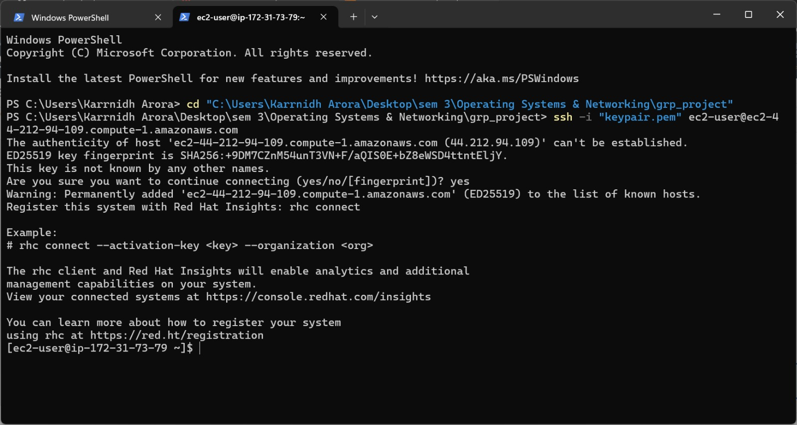
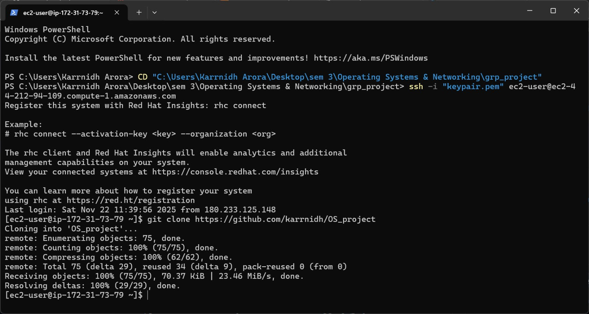
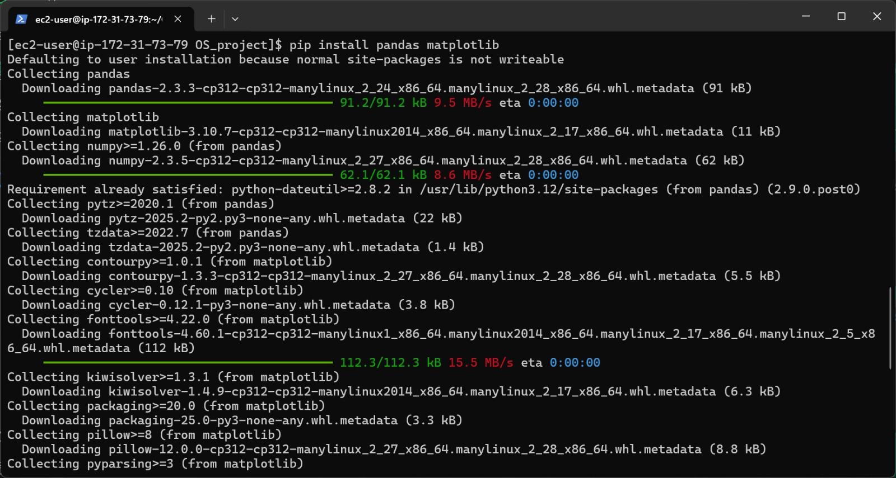
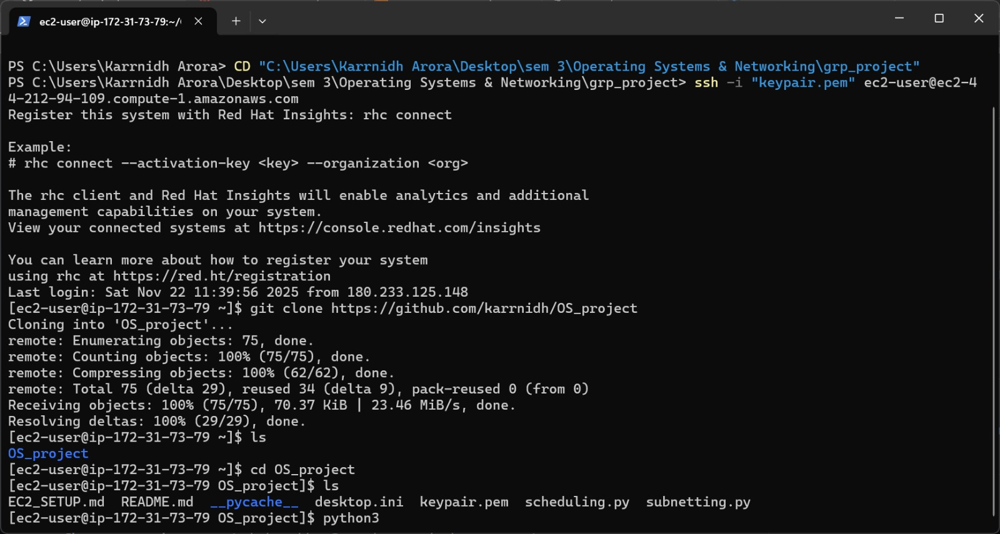

# EC2_SETUP.md
## AWS EC2 Setup Guide for OS Scheduling Project

This document explains how to:

- Launch an EC2 instance  
- Connect using SSH  
- Upload project files  
- Install Python & dependencies  
- Run the scheduling simulator  
- Download Gantt charts  

---

# 1. Launch EC2 Instance

### Step 1 — Open AWS Console  


1. Go to **AWS Console → EC2**  

### Step 2 — Search for EC2  


### Step 3 — Open EC2 Dashboard and Click Launch Instance


2. After Clicking Launch Instance 


3. Choose AMI → **Red Hat Linux**  
4. Instance type → **t3.micro (Free-tier eligible)**  
5. Create/Select Key Pair → download `.pem` file  
6. Configure security group:  
   - Allow **SSH (port 22)** from *My IP*  
7. Click **Launch Instance** then Click 'Connect'


---

# 2. Fix Permissions for .pem Key (Windows)

Open PowerShell in the folder containing your keypair.pem:

```powershell
icacls keypair.pem /inheritance:r
icacls keypair.pem /grant:r "$($env:UserName):(R)"
```

---


# 3. SSH Into EC2

Use your EC2 public DNS:

```powershell
ssh -i "keypair.pem" ec2-user@ec2-44-212-94-109.compute-1.amazonaws.com
```

If prompted → type **yes**.

You are now inside the Linux machine.

---


# 4. Upload Project Files to EC2 (SCP)

From your laptop:

```powershell
scp -i "keypair.pem" scheduling.py subnetting.py ec2-user@ec2-44-212-94-109.compute-1.amazonaws.com:/home/ec2-user/
```

Verify on EC2:

```bash
ls
```

---

# 5. Install Python & Required Libraries

Inside the EC2 terminal:

```bash
sudo yum install -y python3 python3-pip
pip3 install pandas matplotlib
```

---


# 6. Run the Scheduling Simulator

```bash
python3 scheduling.py
python3 subnetting.py
```




This will:

- Fetch live Linux processes  
- Run FCFS, SJF, Priority, RR  
- Produce comparison tables  
- Generate Gantt charts as `.png` images  

Check generated images:

```bash
ls *.png
```

---

# 7. Download Gantt Charts to Your Laptop

From your local system:

```powershell
scp -i "keypair.pem" ec2-user@ec2-44-212-94-109.compute-1.amazonaws.com:/home/ec2-user/*.png .
```

This downloads all charts into your current folder.

---

# Notes

- Use **ec2-user** for Red Hat Linux  
- Ensure port 22 SSH is allowed  
- EC2 is headless → charts are saved, not displayed  
- You can screenshot generated images later for your report  

---

# Done!

Your EC2 instance is fully set up to run the OS Scheduling Simulator.
